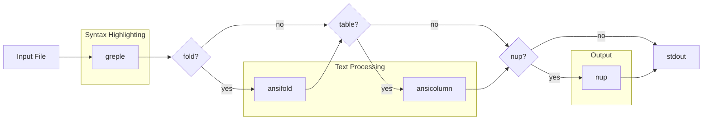

# App-mdee Project Instructions

## Overview

mdee (Markdown, Easy on the Eyes) is a Markdown viewer command implemented as a Bash script. It combines greple for syntax highlighting with nup for multi-column paged output.

## Project Structure

- `script/mdee` - Main script (Bash)
- `lib/App/mdee.pm` - Perl module (version info only)
- `t/` - Test files
- `t/test.md` - Color test file

## Development

### Testing Colors

```bash
./script/mdee t/test.md              # light mode
./script/mdee --mode=dark t/test.md  # dark mode
./script/mdee --list-themes          # show theme samples
```

### Theme System

Themes are defined as Bash associative arrays:
- `theme_default_light` - Light mode theme
- `theme_default_dark` - Dark mode theme

Color specifications use Term::ANSIColor::Concise format:
- `L00` - `L25`: Gray scale (L00=black, L25=white)
- `${base}`: Base color placeholder (expanded after loading)
- `+l10` / `-l10`: Adjust lightness
- `=l50`: Set absolute lightness
- `D`: Bold, `U`: Underline, `E`: Erase line
- `FG/BG`: Foreground/Background

## Implementation Notes

### Pipeline Architecture

mdee constructs a pipeline dynamically:



Each stage is optional (`--[no-]fold`, `--[no-]table`, `--[no-]nup`).

### Greple Options

```bash
greple_opts=(-G --ci=G --all --need=0)
```

- `-G`: Grep mode (line-based matching)
- `--ci=G`: Capture index mode - each captured group gets separate color
- `--all`: Output all lines (not just matches)
- `--need=0`: Output even if no matches

### Color Mapping with --cm

The `--cm` option specifies colors for captured groups, comma-separated:

```bash
--cm 'color1,color2,color3' -E '(group1)(group2)(group3)'
```

### Code Block Color Specification

Format: `opening_fence , language , body , closing_fence`

```bash
[code_block]='L10 , L10 , ${base}/L05;E , L10'
```

- 1st: Opening ``` color
- 2nd: Language specifier (e.g., `bash`, `perl`) color
- 3rd: Code body color (with background)
- 4th: Closing ``` color

Regex pattern:
```
^\h*(?<bt>`{3,}+)(.*)\n((?s:.*?))^\h*(\g{bt})
```

4 capture groups: opening ```, language, body, closing ```

### Inline Code Color Specification

Format: `before , match , after`

```bash
[inline_code]='/L05,/L05,/L05'
```

Regex pattern:
```
(?<bt>`++)((?:(?!\g{bt}).)++)(\g{bt})
```

3 capture groups: opening backticks, content, closing backticks

### Header Colors

Light mode uses light background with dark text:
```bash
[h1]='L25DE/${base}'      # Gray text on base background
[h2]='L25DE/${base}+l10'  # Lighter background
```

Dark mode uses dark background with light text:
```bash
[h1]='L00DE/${base}'       # Black text on base background
[h2]='L00DE/${base}-l10'   # Darker background
[h3]='L00DN/${base}-l15'   # Normal weight, even darker
```

### Greple::tee Module

The `-Mtee` module allows greple to pipe matched regions through external commands.

#### Text Folding with ansifold

```bash
greple \
    -Mtee "&ansifold" --crmode --autoindent="$ITEM_PREFIX" -sw${width} -- \
    -E "${ITEM_PREFIX}.*\\n" --crmode --all --need=0 --no-color
```

- `-Mtee`: Load tee module
- `"&ansifold"`: Call ansifold as function (not subprocess)
- `--crmode`: Handle carriage returns
- `--autoindent="..."`: Auto-indent pattern for list items
- `-sw${width}`: Silent mode with width
- `--`: Separator between tee args and greple args
- `-E "..."`: Pattern to match (list items)

#### Table Formatting with ansicolumn

```bash
greple \
    -Mtee::config=discrete "&ansicolumn" -s '|' -o '|' -t --cu=1 -- \
    -E '^(\|.+\|\n){3,}' --all --need=0 --no-color
```

- `-Mtee::config=discrete`: Process each match separately
- `"&ansicolumn"`: Call ansicolumn as function
- `-s '|'`: Input separator
- `-o '|'`: Output separator
- `-t`: Table mode (auto-determine column widths)
- `--cu=1`: Column unit (minimum column width)
- `-E '^(\|.+\|\n){3,}'`: Match 3+ consecutive table rows

#### Table Separator Fix

After ansicolumn, a perl one-liner fixes the separator line:

```bash
perl -pE 's/ /-/g if /^ \| (\s* -+ \s* \|)+ $/x'
```

This replaces spaces with dashes in the `|---|---|` separator row.

### Mode Detection with Getopt::EX::termcolor

Terminal background luminance is detected via Getopt::EX::termcolor module.

```bash
detect_terminal_mode() {
    local lum
    lum=$(perl -MGetopt::EX::termcolor=luminance -e luminance 2>/dev/null) || return
    [[ -z "$lum" ]] && return

    if (( lum < 50 )); then
        echo "dark"
    else
        echo "light"
    fi
}
```

- `perl -MGetopt::EX::termcolor=luminance`: Import `luminance` function
- `-e luminance`: Execute the function (prints 0-100)
- Returns empty if terminal doesn't support background query
- Luminance < 50: dark mode
- Luminance >= 50: light mode

The module sends OSC 11 query to terminal and parses the response to calculate luminance from RGB values.

### Getopt::Long::Bash (getoptlong.sh)

Option parsing uses getoptlong.sh from Getopt::Long::Bash module.

#### OPTS Array Format

```bash
declare -A OPTS=(
    [&REQUIRE]=0.7.1 [&USAGE]="$USAGE"
    [  option | o  :  # comment  ]=default
)
```

Key format: `option_name | short_opt  spec  # comment`

- `option_name`: Long option name (becomes variable `$option_name`)
- `short_opt`: Single character short option
- `spec`: Option specification
- `# comment`: Description for help

#### Option Specifications

|Spec|Type|Description|
|-|-|-|
|(empty)|Boolean|Flag, sets variable to 1|
|`!`|Negatable|Supports `--no-option`|
|`+`|Incremental|Counter, increases with each use|
|`:`|Required arg|Requires argument value|
|`:=i`|Integer|Requires integer argument|
|`?!`|Optional+Negatable|Optional argument, negatable|
|`:>array`|Array append|Appends `--option=value` to array|

#### Special Keys

- `[&REQUIRE]=version`: Minimum getoptlong.sh version
- `[&USAGE]="..."`: Usage message for --help

#### Callback Functions

If a function with the same name as an option exists, it's called after parsing:

```bash
pager() {
    if [[ -n $pager ]]; then
        nup_opts+=("--pager=$pager")
    else
        nup_opts+=("--no-pager")
    fi
}
```

#### Invocation

```bash
. getoptlong.sh OPTS "$@"
```

Sources the library with OPTS array name and arguments.

### Dependencies

- App::Greple - Pattern matching and highlighting tool with extensive regex support, used for syntax highlighting of Markdown elements including headers, bold text, inline code, and fenced code blocks
- App::ansifold - ANSI-aware text folding utility that wraps long lines while preserving escape sequences and maintaining proper indentation for nested list items
- App::ansicolumn - Column formatting tool with ANSI support that aligns table columns while preserving color codes
- App::nup - Paged output
- App::ansiecho - Color output
- Getopt::Long::Bash - Option parsing
- Getopt::EX::termcolor - Terminal detection

## Build & Release

This project uses Minilla. See global CLAUDE.md for release instructions.

```bash
minil build    # Build and update generated files
minil test     # Run tests
minil release  # Release (interactive)
```

## Markdown Syntax Reference

This section demonstrates various Markdown syntax for testing mdee rendering.

### Blockquotes

> This is a blockquote.
> It can span multiple lines.

> Nested blockquote:
> > Inner quote with **bold** and `code`.

### Numbered Lists

1. First item
2. Second item with `inline code`
3. Third item with **bold text**

### Nested Lists

- Top level item
  - Second level with a longer description that should wrap when displayed in narrow width
    - Third level item
  - Another second level
- Back to top level

1. Numbered top level
   1. Nested numbered
   2. Another nested
2. Back to top

### Task Lists

- [x] Completed task
- [ ] Incomplete task with `code`
- [ ] Another todo item

### Horizontal Rules

Above the line.

---

Below the line.

### Links

- Inline link: [Greple documentation](https://metacpan.org/pod/App::Greple)
- Reference link: [Term::ANSIColor::Concise][tac]

[tac]: https://metacpan.org/pod/Term::ANSIColor::Concise

### Strikethrough

This is ~~deleted text~~ with strikethrough.

### Mixed Formatting

> **Important:** Use `--mode=dark` for dark terminals.
>
> ~~Old syntax~~ is deprecated. Use the new **`--theme`** option instead.

### Definition-style Content

**Term 1**
: Definition of the first term with `code` example.

**Term 2**
: Definition of the second term spanning a longer line that might need to be wrapped when displayed.
